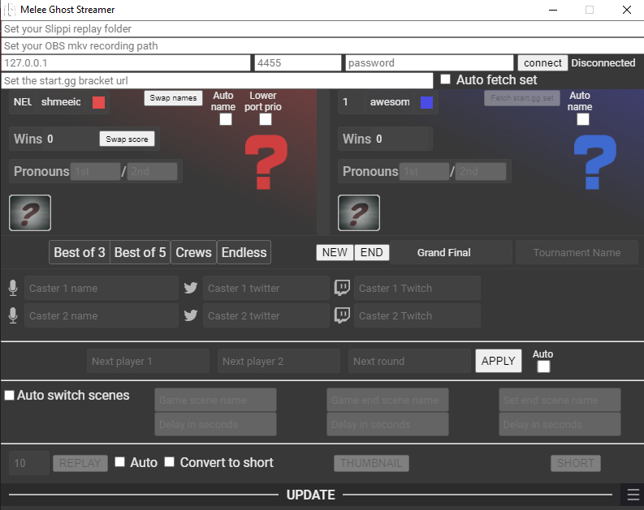
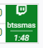

# Melee Ghost Streamer

A fork of [Readek's Melee Stream Tool](https://github.com/Readek/Melee-Stream-Tool) with lots of features added, mainly automation.

## Added features
* Automatically sets the characters, skin and ports based on the Slippi file.
* Automatically fetches the players and round of the current set from start.gg.
* Automatically fetches avatars and set history from PGStats.
* Automatically keeps track of score. Detects handwarmers. Crews mode for decreasing stocks.
* Automatically change the scene in OBS when a game starts, a game ends, or a set ends.
* Automatically cuts out VODs for each set from an ongoing recording. Generates a thumbnail as well.
* Option to prepare information for the next set. Option to automatically apply this when current set ends.
* Option to create a replay. Option to automatically convert each replay to a vertial video (Youtube Short/TikTok).
* Generates more text files and also images to use in OBS.

---

## Install

1. Download the latest [release](https://github.com/Sheepolution/Melee-Ghost-Streamer/releases).
2. Unzip the files.
3. Start `Melee Ghost Streamer.exe`.

⚠️ Note: For the video features (VODs, replays, shorts) you will need [FFmpeg](https://ffmpeg.org/) installed and have it in your [environment path](https://superuser.com/questions/284342/what-are-path-and-other-environment-variables-and-how-can-i-set-or-use-them).

---

## Interface Guide

There is also a [video guide](https://youtu.be/u_fpcUT51-A)!

### Slippi replay folder

The directory where your Slippi files appear in. This is for automatic characters, port and score.

Example: `C:\Users\Sheep\Documents\Slippi\Spectate`

### OBS mkv recording path

The path to your OBS recording. This will be used for making set VODs and replays. Make sure your recording is an `.mkv` file, else it won't work.

Example: `C:\Users\Sheep\Videos\2023-05-17 15-49-51.mkv`

### OBS websocket

This is for automatic stream switching. Enter the information to connect with OBS websocket (In OBS go to Tools -> Websocket Server Settings). You probably only need to set the password, and only if you have enabled the password in OBS. 

### Start.gg bracket url

The url to the bracket on start.gg. Enable `Toggle fetching current match` to apply the users and round of the set currently being played. The set must be ongoing and streamed on Twitch (green with a timer and a Twitch icon).



Note that if your brackets are split over multiple pages you will need to change the url to the bracket that has the current stream match going on.

### Players

* Auto name - Whether to automatically use the Slippi Netplay name as the name of the player.
* Lower port prio - By default the higher port priority is the first player. Enable this to swap it around.
* NEW - Starts a new set. Resets the score and internal data for cutting the VOD. Useful when switching from playing friendlies over to bracket.
* END - End a set. Use this in case the set is over but you missed a game or something.

### Next round

Enter info here on the next round. Click APPLY to move the fields over to the player section above. Enable auto to automatically apply the new info when the current set has ended.

### Scene switching

When you have connected to OBS you can enable automated stream switching. There are three groups of fields. One for starting a game, one for the end of a game, and one for the end of a set. In here you fill in the name of the scene OBS should switch to upon this event happening. Below you can enter a delay. You can add a sequence of scenes separated by a comma.

Example: After a set has ended I want to instantly go to the Player Cam scene. Then go to the Stats scene 8 seconds later. And then after another 15 seconds go to the replays.

```
Player Cam, Stats, Replays
0, 8, 15
```

You can always uncheck automated stream switching if you temporarily want to disable it.

### Replays

Click on the `REPLAY` button to create a replay, or use the shortcut `F9`. This requires you to have an OBS mkv recording path set. You can set the duration of the recording. By default this is 10 seconds. See [Showing replays][#Showing%20replays] for using an OBS script that will help you showcase these replays.

Replays will appear in the `Replays` folder in the directory of your OBS mkv recording path.

You can check `Auto` to automatically make replays when a combo happens. The current conditions for a combo are a combination of two of these:

* Percentage is increased by 30%
* There were 4 or more consecutive moves
* The combo killed

Depending on the player this can make for either a lot or no replays, and won't be of the best quality. Therefore you should only use this option when you have no one to manually click the replay button. In the future I will add an option to configure these conditions.

#### Shorts

You can enable `Convert to short` to automatically convert a replay into a Youtube Short/TikTok video (a vertical video). The way this works is that it cuts the video into three parts. This is with the assumption that most Melee layouts have a left bar, a right bar, and the game in the center. You can configure the coordinates in [resources/Recordings/Shorts/coordinates.json](resources/Recordings/Shorts/coordinates.json). When `scaleVertical` is set to `false` the left and right bar will be scaled until the reach the center. When set to `true` they scale until they reach the bottom. The height of the video is the width of the center part * 16 / 9, to create a 9:16 resolution. Currently the automated shorts are limited to this three parts usecase.

You can click the `SHORT` button to create a short by hand. For this, instead of the OBS mkv recording path, you set the path to the video you want to turn into a short.

Shorts will appear in the `Shorts` folder in the directory of your OBS mkv recording path.

### Settings

Click the hamburger menu in the bottom right to open the settings. Press escape or click somewhere on the left to go back.

* Allow intro - Plays an intro on [Game Scoreboard.html](html/Game%20Scoreboard.html) whenever the file loads.
* Forces the [W]/[L] buttons to appear on the interface. They will always appear when typing 'Grand' on the round box.
* Uppercase text - Makes all the text uppercase. Kinda useless actually when I realized OBS has an option for this.
* Add space - Adds a space to all text. In OBS text can be cut off with certain fonts. Adding a space is a dumb solution that works.

#### Create set VODs

Enable this to automatically create a VOD of a set after it has ended. The end of a set is when a player has 2 wins in a best of 3, 3 wins in a best of 5, or 0 stocks in Crews. You will also need to set the OBS mkv recording path for this to work. It will cut a video of 15 seconds before the start of the first game, up to 15 seconds after the game has ended.

A thumbnail will be created as well. You can customize this thumbnail a bit by changing the images and font in [resources\Recordings\Thumbnails](resources\Recordings\Thumbnails). You can click the `THUMBNAIL` button to create a thumbnail manually. It will use the information in the tool for this (tournament name, round, player names, characters).

#### Fetch PGStats info

Enable this to fetch the avatars and set history of the players, based on the names you filled in the player fields. Note that this can take a few seconds. When there are multiple players with the same name on PGStats it will try to find the correct player with a few tricks. If all fails, it will use the player that has most recently entered a tournament.

### Shortcuts
- Press `Enter` to update.
- Press either `F1` or `F2` to increase P1's or P2's score.
- Press `ESC` to clear player info.
- Press `F9` to create a replay.

---

## Using it in OBS

If you want to use a custom layout in OBS instead of [Game Scoreboard.html](html/Game%20Scoreboard.html) you can use the text files in [resources/Texts/Simple Texts](resources/Texts/Simple%20Texts) and the images in [resources/Players](resources/Players).

Image `port1.png` up to `port4.png` will be copied to `portP1.png` and `portP2.png`. The image `unknown.png` will be copied to `player1.png` and `player2.png` in case no PGStats avatar can be found. You can change these images, as well as any other image in the resources, to fit your layout.

### Showing replays

With an OBS script you can automatically add the replays to a VLC source. For this you need to have Python and VLC installed.

1. Create a VLC source.
2. In OBS go to Tools -> Scripts.
3. Go to Python Settings tab and enter the path to your Python.exe. For me that is: `C:/Users/Sheep/AppData/Local/Programs/Python/Python310`.
4. Go back to the Scripts tab and click on the + icon in the bottom left corner.
5. Select [scripts/auto_replays.py](scripts/auto_replays.py)
6. In the options on the righ, enter the directory where the replays will appear. In the directory with your OBS mkv recording a folder will be made named Replays when making your first replay. You can do this manually to be able to select the folder.
7. Select the VLC source created in step 1.

Now when you create a replay the script will detect this and add it to the VLC source. After you have opened the scene with this source, and you create another replay, it will empty the playlist and add this new replay.

Example:
1. You are on the scene `Match` and create three replays.
2. You go to the scene `Replays` with the VLC source.
3. You go back to the scene `Match`.
4. You create another replay. Because you have opened the scene with the VLC source, the other three replays are removed from the playlist, and this new replay will be added. 

### Game Scoreboard.html guide

These are instructions for regular OBS Studio, but I imagine you can do the same with other streaming software:
- Drag and drop [html/Game Scoreboard.html](html/Game%20Scoreboard.html) into OBS, or add a new browser source in OBS pointing at the local file.
- If the source looks weird, manually set the source's properties to 1920 width and 1080 height, or set your OBS canvas resolution to 1080p, or make the source fit the screen.
- In the source's properties, change *Use custom frame rate* -> `60` (if streaming at 60fps of course).
- **Also tick** `Refresh browser when scene becomes active`.
- Manage it all with the `Melee Ghost Streamer` executable.

2 basic transitions are included in the `Resources/OBS Transitions` folder, if you don't have a transition yourself of course. To use them on OBS:
- Add a new stinger transition.
- Set the video file to `Game In.webm` or `Swoosh.webm`.
- Transition point -> `350 ms`.
- I recommend you to set the Audio Fade Style to crossfade, just in case.
- On the scene's right click menu, set it to Transition Override to the transition you just created.

The interface will also update basic text files with the match info at `Resources/Texts/Simple Texts/` so you can add them to OBS with ease.

If you drop an image in `Resources/Team Logos/` and write the name of the image to the tag of a player, the image will appear on the game overlay.

#### Customizing stuff

For the overlays/images, there are PSD files for both the game scoreboard and the VS screen to help you customize them.

For the video backgrounds, you can either replace them with other `.webm` files or just cover them with an image overlay.

And if you're brave enough to dive into the code, I tried my best to document everything inside the code so you have an easier time, so go grab those `html` and `js` files!

---

## Disclaimer

Shoutouts to Readek for not only making the base of this tool, but creating a fancy looking interface as well. I myself was too lazy to keep it fancy, and focused only on functionality. It works, so mission accomplished, but because of that the UI is not great. It looks ugly, you don't get any confirmation when changing fields or clicking buttons, and the UI for changing the scenes is dumb. If you want to improve this your contributions are appreciated.

---

## Developing and building

If you want to make changes to the tool, you can do so by following these steps:

1. Download or clone this project.
2. Install [Node](https://nodejs.org/en) (use the left LTS option).
3. Open a terminal in the app directory (right click -> Open in Terminal).
4. Type `npm install --global yarn` to install Yarn.
5. Type `npm install -g electron` to install Electorn.
6. Type `npm install` to install the dependencies. This takes a while. You can ignore warnings.
7. Type `npm start` to start the app.

Most of the code is in [gui.js](app/src/gui.js).

You can use `npm run dist` to build a new executable.

---
## Shmeeli

## Sheepolution

If you use this tool for your tournament/local I would love to know. It might motivate me to continue working on it, and who knows, maybe make a proper UI. For that, or for any questions, contact me on Twitter [@Sheepolution](https://twitter.com/Sheepolution).

If you're generous, you can tip me here: [Buy me a ko-fi](https://ko-fi.com/sheepolution). But  consider tipping Readek as well. This tool would not have existed without him.

## Readek's original message

Do you want to adapt [[the original tool](https://github.com/Readek/Melee-Stream-Tool)] to another game but can't figure out how to? Lucky for you, I'm open for commisions! Contact me on Twitter [@Readeku](https://twitter.com/Readeku) or on Discord `Readek#5869`!

Do you want to support [[the original tool](https://github.com/Readek/Melee-Stream-Tool)]? [Buy me a ko-fi](https://ko-fi.com/readek) or tip me [directly](https://streamlabs.com/readek/tip)!

---

Resources: [The spriters resource](https://www.spriters-resource.com/search/?q=melee), the [Melee HD Asset Library](https://assets.melee.tv/), and the [VS poses](https://smashboards.com/threads/download-available-poses-for-classic-mode-vs.435797/).

